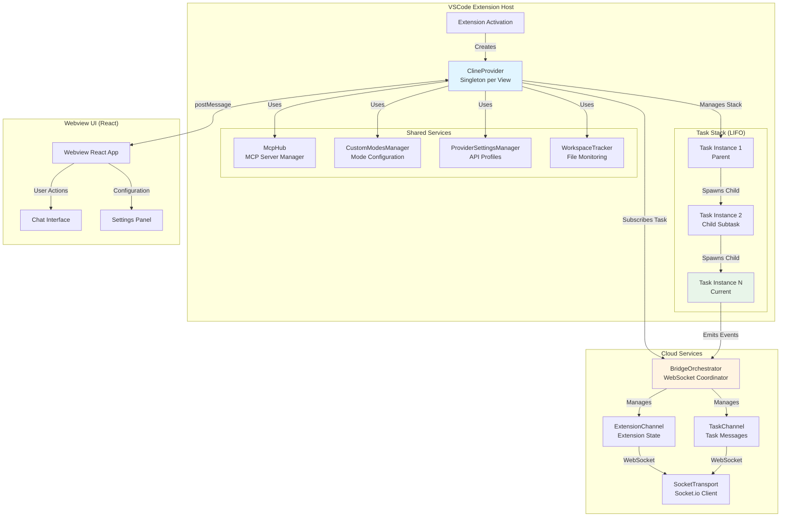
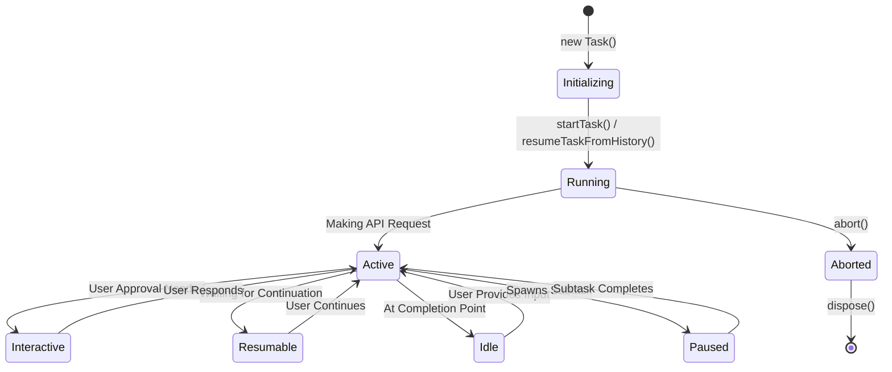
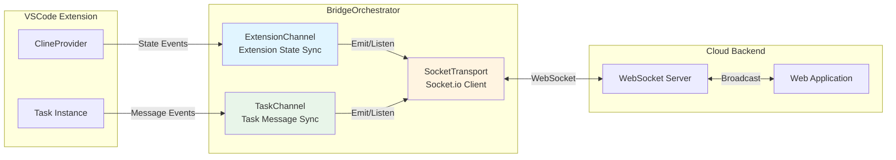
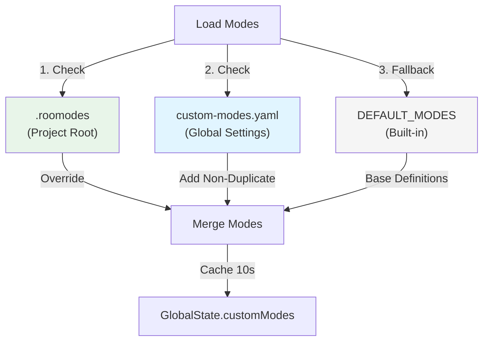
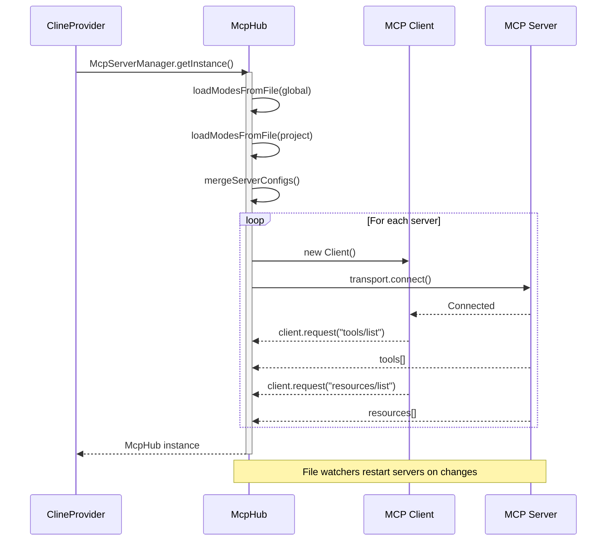
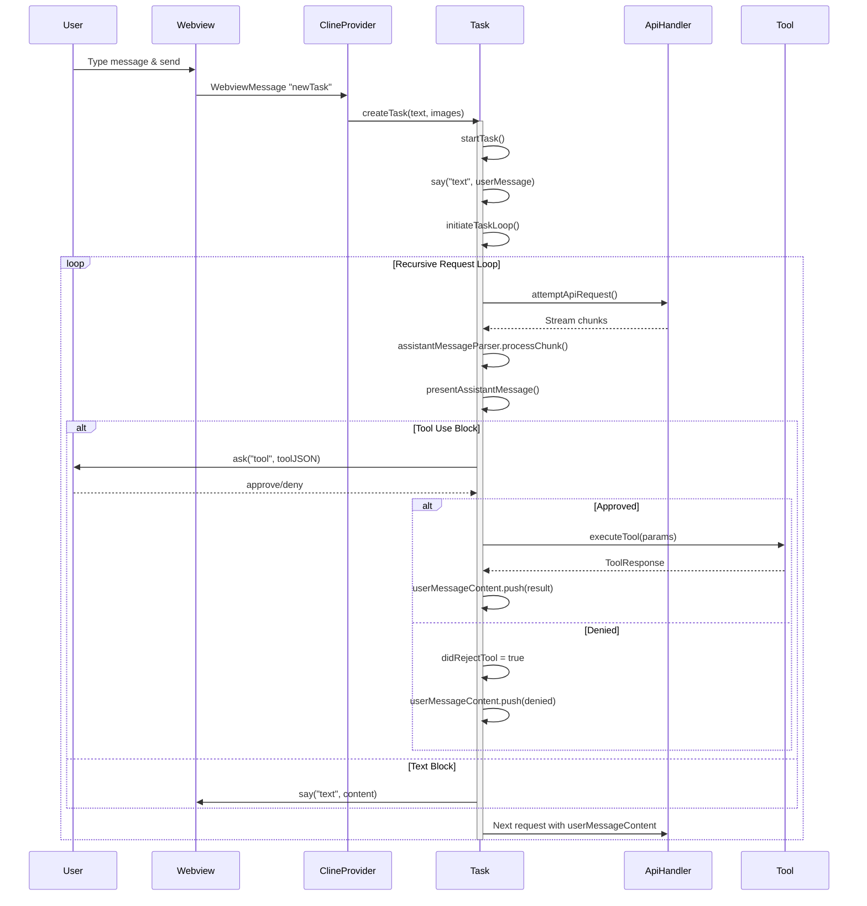
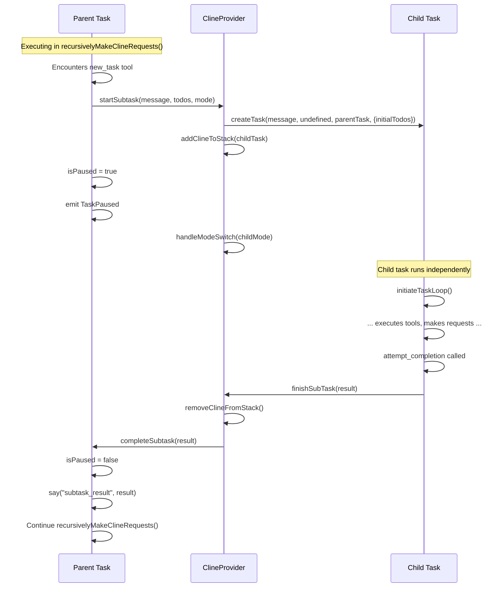
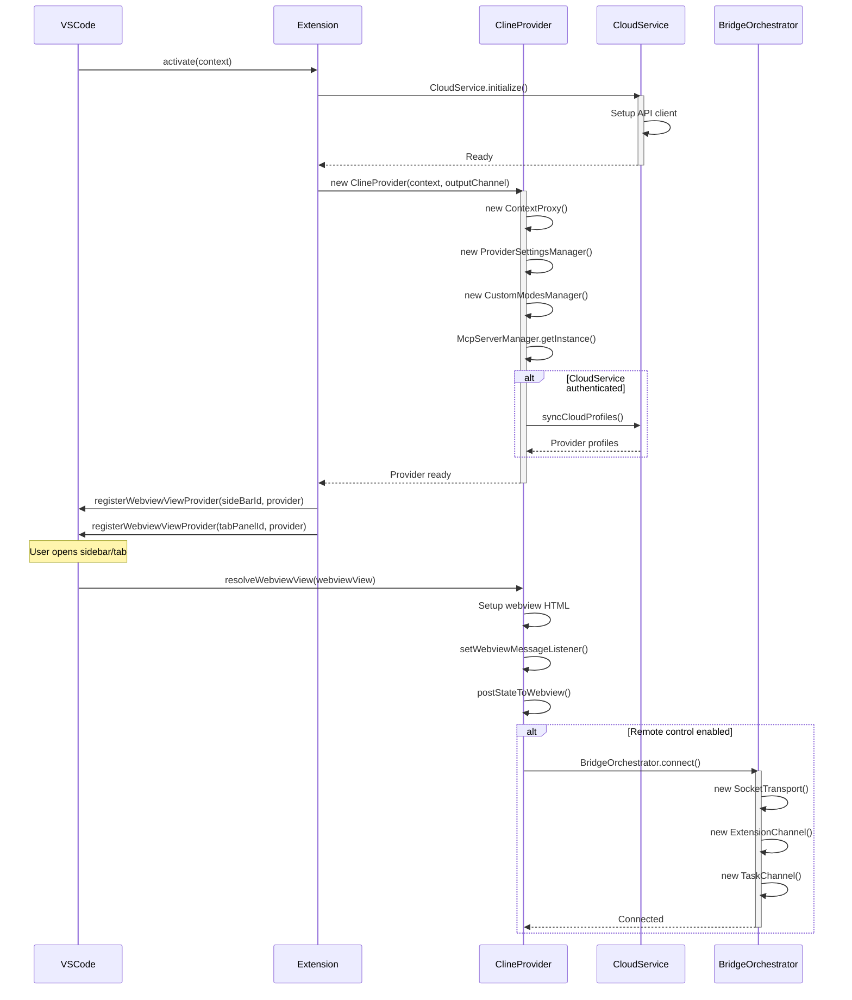
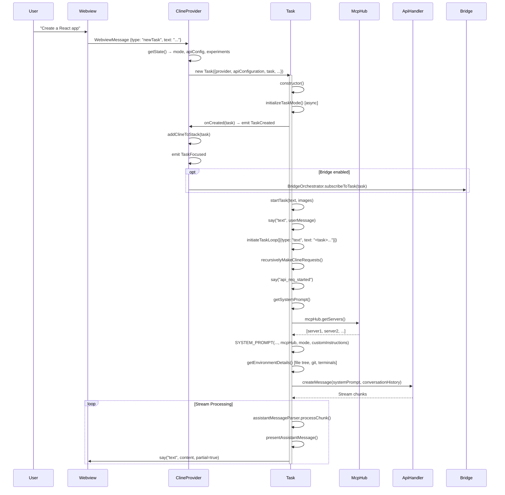

# Roo Code Architecture Map

**Task 0.2**: Comprehensive architectural documentation for Touch and Go parallel agent execution extension.

**Last Updated**: 2025-11-01  
**Author**: Roo (Architect Mode)  
**Version**: 1.0

---

## Table of Contents
1. [Executive Summary](#executive-summary)
2. [System Architecture Overview](#system-architecture-overview)
3. [Core Components](#core-components)
4. [Data Flow Patterns](#data-flow-patterns)
5. [Message Passing Architecture](#message-passing-architecture)
6. [Initialization Sequences](#initialization-sequences)
7. [Extension Points for Parallel Execution](#extension-points-for-parallel-execution)

---

## Executive Summary

Roo Code follows a **provider-task-bridge** architecture pattern where:
- **ClineProvider** acts as the singleton orchestrator managing agent lifecycles
- **Task** instances represent individual agent execution contexts
- **BridgeOrchestrator** enables cloud synchronization and remote control via WebSocket
- **Mode System** provides role-based agent specialization
- **MCP Hub** integrates external tool providers

The architecture is designed for **single-agent execution** with support for **sequential subtasks**. Extension to parallel execution requires minimal core changes due to clean separation of concerns.

---

## System Architecture Overview



### Key Architectural Patterns

1. **Provider Pattern**: [`ClineProvider`](src/core/webview/ClineProvider.ts:118) implements `WebviewViewProvider` and manages the entire extension lifecycle.

2. **Task Stack (LIFO)**: Tasks are managed in a stack where:
   - New tasks push onto the stack
   - Active task is always `clineStack[length - 1]`
   - Subtask completion pops from stack, resuming parent

3. **Event-Driven Communication**: All components communicate via EventEmitter pattern with typed events from [`@roo-code/types`](packages/types/src/events.ts:1).

4. **Weak References**: Provider uses `WeakRef<ClineProvider>` in Task to prevent memory leaks.

---

## Core Components

### 1. ClineProvider

**File**: [`src/core/webview/ClineProvider.ts`](src/core/webview/ClineProvider.ts:1)

**Responsibilities**:
- Singleton provider per webview (sidebar or editor tab)
- Task lifecycle management via `clineStack: Task[]`
- Webview communication via `postMessage` API
- Global state management through `ContextProxy`
- MCP server coordination through `McpHub`

**Critical Properties**:
```typescript
class ClineProvider {
    private clineStack: Task[] = []                    // LIFO task stack
    private view?: vscode.WebviewView | vscode.WebviewPanel
    protected mcpHub?: McpHub                          // MCP integration
    public readonly providerSettingsManager: ProviderSettingsManager
    public readonly customModesManager: CustomModesManager
    private static activeInstances: Set<ClineProvider> = new Set()
}
```

**Task Management Methods**:
- [`createTask(text, images, parentTask, options)`](src/core/webview/ClineProvider.ts:2519) - Spawn new task
- [`createTaskWithHistoryItem(historyItem)`](src/core/webview/ClineProvider.ts:859) - Resume from history
- [`addClineToStack(task)`](src/core/webview/ClineProvider.ts:400) - Push task to stack
- [`removeClineFromStack()`](src/core/webview/ClineProvider.ts:437) - Pop and cleanup task
- [`finishSubTask(lastMessage)`](src/core/webview/ClineProvider.ts:485) - Complete child, resume parent

**Singleton Access Pattern**:
```typescript
static async getInstance(): Promise<ClineProvider | undefined> {
    let visibleProvider = ClineProvider.getVisibleInstance()
    if (!visibleProvider) {
        await vscode.commands.executeCommand(`${Package.name}.SidebarProvider.focus`)
        visibleProvider = ClineProvider.getVisibleInstance()
    }
    return visibleProvider
}
```

---

### 2. Task (Agent Instance)

**File**: [`src/core/task/Task.ts`](src/core/task/Task.ts:1)

**Identity**:
- `taskId`: UUID for persistence and history
- `instanceId`: 8-char UUID for runtime instance tracking
- `taskNumber`: Position in task hierarchy
- `parentTaskId`, `rootTaskId`, `childTaskId`: Task tree relationships

**Core Lifecycle**:
```typescript
class Task extends EventEmitter<TaskEvents> {
    // Identity
    readonly taskId: string             // Persistent ID
    readonly instanceId: string         // Runtime instance ID
    
    // Hierarchy
    readonly rootTask?: Task            // First task in chain
    readonly parentTask?: Task          // Direct parent
    childTaskId?: string                // Active child
    
    // State
    abort: boolean = false              // Termination flag
    abandoned: boolean = false          // Cleanup flag
    isPaused: boolean = false           // Waiting for subtask
    
    // Conversation
    apiConversationHistory: ApiMessage[] = []    // API format
    clineMessages: ClineMessage[] = []           // UI format
    
    // Streaming
    isStreaming: boolean = false
    assistantMessageContent: AssistantMessageContent[] = []
    userMessageContent: Anthropic.Messages.ContentBlockParam[] = []
}
```

**Task State Machine**:


**Message Loop Flow**:
```typescript
// Simplified from initiateTaskLoop() and recursivelyMakeClineRequests()
async initiateTaskLoop(userContent) {
    while (!this.abort) {
        const didEndLoop = await this.recursivelyMakeClineRequests(userContent)
        if (didEndLoop) break
        userContent = [{ type: "text", text: formatResponse.noToolsUsed() }]
    }
}

async recursivelyMakeClineRequests(userContent) {
    // Build system prompt with mode, MCP tools, custom instructions
    const systemPrompt = await this.getSystemPrompt()
    
    // Add environment details (file tree, terminals, etc.)
    const environmentDetails = await getEnvironmentDetails(this, includeFileDetails)
    
    // Make API request
    const stream = this.attemptApiRequest()
    
    // Process stream chunks
    for await (const chunk of stream) {
        if (chunk.type === "text") {
            // Parse into tool_use blocks via AssistantMessageParser
            this.assistantMessageContent = this.assistantMessageParser.processChunk(chunk.text)
            
            // Execute tools via presentAssistantMessage()
            presentAssistantMessage(this)
        }
    }
    
    // Tool results become next userContent
    if (this.userMessageContent.length > 0) {
        return await this.recursivelyMakeClineRequests(this.userMessageContent)
    }
}
```

---

### 3. BridgeOrchestrator (Cloud Sync)

**File**: [`packages/cloud/src/bridge/BridgeOrchestrator.ts`](packages/cloud/src/bridge/BridgeOrchestrator.ts:1)

**Architecture**: Two-channel WebSocket system for extension and task synchronization.



**WebSocket Events**:

*ExtensionChannel*:
- `ExtensionSocketEvents.REGISTER`: Register extension instance
- `ExtensionSocketEvents.HEARTBEAT`: Keep-alive (every 30s)
- `ExtensionSocketEvents.EVENT`: Extension-level events (TaskCreated, TaskStarted, etc.)
- `ExtensionSocketEvents.RELAYED_COMMAND`: Receive remote commands (StartTask, StopTask, ResumeTask)

*TaskChannel*:
- `TaskSocketEvents.JOIN`: Subscribe to task updates
- `TaskSocketEvents.LEAVE`: Unsubscribe from task
- `TaskSocketEvents.EVENT`: Task-level events (Message, TaskModeSwitched, TaskInteractive)
- `TaskSocketEvents.RELAYED_COMMAND`: Receive task commands (Message, ApproveAsk, DenyAsk)

**Connection Lifecycle**:
```typescript
// From BridgeOrchestrator.ts
static async connect(options: BridgeOrchestratorOptions) {
    BridgeOrchestrator.instance = new BridgeOrchestrator(options)
    await instance.connect()  // Initiates SocketTransport
    
    // Auto-subscribe to tasks created before connection
    if (BridgeOrchestrator.pendingTask) {
        await instance.subscribeToTask(pendingTask)
    }
}

// Task subscription
async subscribeToTask(task: TaskLike) {
    await this.taskChannel.subscribeToTask(task, socket)
    // Sets up event listeners for task events
}
```

---

### 4. Mode System

**Files**:
- [`src/shared/modes.ts`](src/shared/modes.ts:1) - Mode definitions and utilities
- [`src/core/config/CustomModesManager.ts`](src/core/config/CustomModesManager.ts:1) - Mode file management

**Mode Configuration Structure**:
```typescript
interface ModeConfig {
    slug: string                    // Unique identifier (e.g., "architect", "code")
    name: string                    // Display name
    roleDefinition: string          // System prompt role section
    description?: string            // User-facing description
    whenToUse?: string              // Guidance for mode selection
    customInstructions?: string     // Additional mode-specific instructions
    groups: readonly GroupEntry[]   // Tool groups available to mode
    source?: "project" | "global"   // Where mode is defined
}

type GroupEntry = ToolGroup | [ToolGroup, GroupOptions]

interface GroupOptions {
    fileRegex?: string              // Restrict edits to matching files
    description?: string            // Restriction explanation
}
```

**Mode Loading Hierarchy** (Project Precedence):


**Tool Group System**:
```typescript
// From src/shared/tools.ts
const TOOL_GROUPS = {
    edit: ["write_to_file", "apply_diff", "insert_content"],
    read: ["read_file", "list_files", "list_code_definition_names", "search_files"],
    execute: ["execute_command"],
    browser: ["browser_action"],
    mcp: ["use_mcp_tool", "access_mcp_resource"],
    // ... more groups
}

// Example: Architect mode restricting edits to markdown
{
    slug: "architect",
    groups: [
        ["edit", { fileRegex: "\\.md$", description: "Markdown files only" }],
        "read"  // Full read access
    ]
}
```

**File Restriction Validation**:
```typescript
// From modes.ts:isToolAllowedForMode()
function isToolAllowedForMode(tool, modeSlug, customModes, toolParams) {
    const mode = getModeBySlug(modeSlug, customModes)
    
    for (const group of mode.groups) {
        const groupName = getGroupName(group)
        const options = getGroupOptions(group)
        
        if (groupName === "edit" && options?.fileRegex) {
            const filePath = toolParams?.path
            if (!doesFileMatchRegex(filePath, options.fileRegex)) {
                throw new FileRestrictionError(mode.name, options.fileRegex, filePath)
            }
        }
    }
}
```

---

### 5. MCP Integration

**File**: [`src/services/mcp/McpHub.ts`](src/services/mcp/McpHub.ts:1)

**Two-Level Configuration**:
1. **Global**: `~/.roo-code/settings/mcp-settings.json` (all projects)
2. **Project**: `{workspace}/.roo/mcp.json` (workspace-specific)

**Server Connection Types**:
```typescript
// stdio: Local process communication
{
    "type": "stdio",
    "command": "node",
    "args": ["build/index.js"],
    "env": { "API_KEY": "${env:MY_API_KEY}" }
}

// sse: Server-Sent Events (HTTP streaming)
{
    "type": "sse",
    "url": "https://api.example.com/mcp",
    "headers": { "Authorization": "Bearer ${env:TOKEN}" }
}

// streamable-http: HTTP with streaming
{
    "type": "streamable-http",
    "url": "https://api.example.com/mcp",
    "headers": { "X-API-Key": "${env:KEY}" }
}
```

**Connection Management**:


**Tool Discovery and Registration**:
```typescript
// Tools are fetched per server and merged into system prompt
async fetchToolsList(serverName: string): Promise<McpTool[]> {
    const connection = this.findConnection(serverName)
    const response = await connection.client.request({ method: "tools/list" })
    
    // Apply configuration
    return response.tools.map(tool => ({
        ...tool,
        alwaysAllow: config.alwaysAllow.includes(tool.name),
        enabledForPrompt: !config.disabledTools.includes(tool.name)
    }))
}
```

**System Prompt Integration**:
MCP tools are dynamically injected into the system prompt via [`SYSTEM_PROMPT()`](src/core/prompts/system.ts:1):
```typescript
if (mcpHub) {
    const servers = mcpHub.getServers()
    for (const server of servers) {
        systemPrompt += `\n## ${server.name}\n`
        for (const tool of server.tools.filter(t => t.enabledForPrompt)) {
            systemPrompt += `- ${tool.name}: ${tool.description}\n`
            systemPrompt += `  Input Schema: ${JSON.stringify(tool.inputSchema)}\n`
        }
    }
}
```

---

## Data Flow Patterns

### User Message → API Request → Tool Execution → Response



### Task Spawning and Subtask Completion



---

## Message Passing Architecture

### Webview ↔ Extension Communication

**Message Types**:

*Extension → Webview* ([`ExtensionMessage`](src/shared/ExtensionMessage.ts:1)):
```typescript
type ExtensionMessage =
    | { type: "state"; state: ExtensionState }
    | { type: "theme"; text: string }
    | { type: "messageUpdated"; clineMessage: ClineMessage }
    | { type: "mcpServers"; mcpServers: McpServer[] }
    | { type: "action"; action: string; ... }
    // ... 20+ message types
```

*Webview → Extension* ([`WebviewMessage`](src/shared/WebviewMessage.ts:1)):
```typescript
type WebviewMessage =
    | { type: "newTask"; text?: string; images?: string[] }
    | { type: "askResponse"; askResponse: ClineAskResponse; text?: string }
    | { type: "mode"; text: Mode }
    | { type: "saveApiConfiguration"; text: string; apiConfiguration: ProviderSettings }
    // ... 50+ message types
```

**Message Handler Pattern**:
```typescript
// From webviewMessageHandler.ts
export const webviewMessageHandler = async (
    provider: ClineProvider,
    message: WebviewMessage,
    marketplaceManager?: MarketplaceManager
) => {
    switch (message.type) {
        case "newTask":
            await provider.createTask(message.text, message.images)
            break
        case "askResponse":
            provider.getCurrentTask()?.handleWebviewAskResponse(
                message.askResponse, 
                message.text, 
                message.images
            )
            break
        // ... 50+ cases
    }
}
```

### Task Event Broadcasting

```typescript
// From ClineProvider.ts taskCreationCallback
this.taskCreationCallback = (instance: Task) => {
    this.emit(RooCodeEventName.TaskCreated, instance)
    
    // Forward all task events to provider
    instance.on(RooCodeEventName.TaskStarted, () => 
        this.emit(RooCodeEventName.TaskStarted, instance.taskId))
    instance.on(RooCodeEventName.TaskCompleted, (taskId, tokenUsage, toolUsage) =>
        this.emit(RooCodeEventName.TaskCompleted, taskId, tokenUsage, toolUsage))
    // ... 10+ event forwarders
}
```

---

## Initialization Sequences

### Extension Activation



### Task Creation and Startup



---

## Extension Points for Parallel Execution

Based on the architecture analysis, here are the **clean extension points** for implementing Touch and Go parallel agent execution:

### 1. **Task Spawning Interface** ✅ READY

**Current Pattern** (Sequential):
```typescript
// From ClineProvider.ts:createTask()
async createTask(text, images, parentTask, options) {
    const task = new Task({
        provider: this,
        apiConfiguration,
        task, images,
        rootTask: this.clineStack[0],
        parentTask,
        onCreated: this.taskCreationCallback
    })
    
    await this.addClineToStack(task)  // Blocks until task completes
    return task
}
```

**Extension Point for Parallel**:
```typescript
// New method to spawn without blocking
async spawnParallelTask(text, images, parentTask, options) {
    const task = new Task({
        provider: this,
        apiConfiguration,
        task, images,
        rootTask: parentTask || this.clineStack[0],
        parentTask,
        onCreated: this.taskCreationCallback,
        startTask: true  // Immediately starts without blocking
    })
    
    // Don't add to stack - manage separately in parallel pool
    this.parallelTasks.set(task.taskId, task)
    
    // Listen for completion
    task.once(RooCodeEventName.TaskCompleted, () => {
        this.parallelTasks.delete(task.taskId)
    })
    
    return task
}
```

**What NOT to Change**:
- Task constructor and initialization logic
- Event emission system
- Message persistence
- Tool execution flow

**What TO Add**:
- New `parallelTasks: Map<string, Task>` collection in ClineProvider
- Parallel task spawning method (doesn't use stack)
- Parallel task coordination logic (wait for multiple, collect results)

---

### 2. **Message Routing** ✅ READY

**Current Pattern**:
```typescript
// All messages route to current task
provider.getCurrentTask()?.handleWebviewAskResponse(...)
```

**Extension Point**:
```typescript
// Route messages by taskId
async routeMessageToTask(taskId: string, askResponse, text, images) {
    // Check active stack
    const stackTask = this.clineStack.find(t => t.taskId === taskId)
    if (stackTask) {
        stackTask.handleWebviewAskResponse(askResponse, text, images)
        return
    }
    
    // Check parallel tasks
    const parallelTask = this.parallelTasks.get(taskId)
    if (parallelTask) {
        parallelTask.handleWebviewAskResponse(askResponse, text, images)
        return
    }
    
    throw new Error(`Task ${taskId} not found`)
}
```

**What NOT to Change**:
- `handleWebviewAskResponse` implementation
- Message validation logic
- Event emission

---

### 3. **Workspace Isolation** ✅ READY

Each Task already has isolated context:

```typescript
class Task {
    readonly workspacePath: string              // Task-specific workspace
    rooIgnoreController: RooIgnoreController    // Per-task ignore rules
    fileContextTracker: FileContextTracker      // Per-task file tracking
    terminalProcess?: RooTerminalProcess        // Per-task terminal
    browserSession: BrowserSession              // Per-task browser
    diffViewProvider: DiffViewProvider          // Per-task diff view
}
```

**No Changes Needed** - Tasks are already workspace-isolated!

---

### 4. **BridgeOrchestrator Task Sync** ✅ READY

**Current Pattern** (Single task):
```typescript
// From BridgeOrchestrator.ts
async subscribeToTask(task: TaskLike) {
    await this.taskChannel.subscribeToTask(task, socket)
}
```

**Extension Ready**:
- Already supports multiple task subscriptions via `TaskChannel`
- Uses `subscribedTasks: Map<string, TaskLike>` internally
- No changes needed for parallel tasks

```typescript
// TaskChannel.ts - already handles multiple tasks
class TaskChannel {
    private subscribedTasks: Map<string, TaskLike> = new Map()
    
    async subscribeToTask(task: TaskLike, socket: Socket) {
        await this.publish(TaskSocketEvents.JOIN, { taskId })
        this.subscribedTasks.set(taskId, task)
        this.setupTaskListeners(task)  // Per-task event forwarding
    }
}
```

---

### 5. **State Management** ⚠️ NEEDS EXTENSION

**Current Pattern**:
```typescript
// Single task context
const state = await provider.getStateToPostToWebview()
// Returns: { currentTaskItem, clineMessages, currentTaskTodos, ... }
```

**Extension Needed**:
```typescript
// Multi-task context
interface ExtensionState {
    // Existing single-task fields
    currentTaskItem?: HistoryItem
    clineMessages: ClineMessage[]
    
    // NEW: Parallel task support
    parallelTasks?: Map<string, {
        taskId: string
        taskItem: HistoryItem
        messages: ClineMessage[]
        status: TaskStatus
    }>
    
    // NEW: Active parallel operations
    activeParallelOperations?: {
        coordinatorTaskId: string
        subtaskIds: string[]
        completedCount: number
    }
}
```

---

### 6. **Clean Separation Boundaries**

The architecture provides **three clean extension layers**:

| Layer | Current Behavior | Parallel Extension | Impact |
|-------|-----------------|-------------------|---------|
| **Provider** | Manages single task stack | Add parallel task pool | Local to ClineProvider |
| **Task** | Self-contained execution | No changes needed | Zero impact |
| **Bridge** | Already multi-task aware | No changes needed | Zero impact |

**Reusable Without Modification**:
- ✅ Task lifecycle (start, abort, dispose)
- ✅ Tool execution pipeline
- ✅ Message persistence
- ✅ Checkpoint system
- ✅ MCP integration
- ✅ Mode system
- ✅ BridgeOrchestrator sync

**Requires Extension**:
- ⚠️ ClineProvider parallel task management
- ⚠️ Webview UI for multi-task display
- ⚠️ State serialization for parallel context

---

## Key Interfaces and Contracts

### TaskProviderLike

**File**: [`packages/types/src/task.ts`](packages/types/src/task.ts:1)

```typescript
export interface TaskProviderLike {
    // Task Management
    getCurrentTask(): TaskLike | undefined
    createTask(text?: string, images?: string[], parentTask?: TaskLike, 
               options?: CreateTaskOptions, configuration?: RooCodeSettings): Promise<TaskLike>
    cancelTask(): Promise<void>
    clearTask(): Promise<void>
    resumeTask(taskId: string): void
    
    // Mode Management
    getModes(): Promise<{ slug: string; name: string }[]>
    getMode(): Promise<string>
    setMode(mode: string): Promise<void>
    
    // Provider Profile Management
    getProviderProfiles(): Promise<{ name: string; provider?: string }[]>
    getProviderProfile(): Promise<string>
    setProviderProfile(name: string): Promise<void>
    
    // Telemetry
    getTelemetryProperties(): Promise<TelemetryProperties>
    
    // Events
    on<K extends keyof TaskProviderEvents>(event: K, listener: (...args: TaskProviderEvents[K]) => void): this
    off<K extends keyof TaskProviderEvents>(event: K, listener: (...args: TaskProviderEvents[K]) => void): this
}
```

This interface defines the **contract** that any parallel task coordinator must implement.

---

### TaskLike

**File**: [`packages/types/src/task.ts`](packages/types/src/task.ts:1)

```typescript
export interface TaskLike {
    // Identity
    readonly taskId: string
    readonly instanceId: string
    readonly rootTaskId?: string
    readonly parentTaskId?: string
    readonly taskNumber: number
    readonly workspacePath: string
    childTaskId?: string
    
    // Metadata
    readonly metadata: TaskMetadata
    
    // State
    taskStatus: TaskStatus
    taskAsk?: ClineMessage
    queuedMessages: QueuedMessage[]
    tokenUsage?: TokenUsage
    todoList?: TodoItem[]
    cwd: string
    
    // Lifecycle
    waitForModeInitialization(): Promise<void>
    submitUserMessage(text: string, images?: string[], mode?: string, providerProfile?: string): Promise<void>
    approveAsk(options?: { text?: string; images?: string[] }): void
    denyAsk(options?: { text?: string; images?: string[] }): void
    
    // Events
    on<K extends keyof TaskEvents>(event: K, listener: (...args: TaskEvents[K]) => void): this
    off<K extends keyof TaskEvents>(event: K, listener: (...args: TaskEvents[K]) => void): this
}
```

This interface ensures **Task instances can run independently** without tight coupling to ClineProvider.

---

## Tool Execution Pipeline

### Tool Registration and Validation

```mermaid
graph LR
    subgraph "System Prompt Generation"
        Mode[Mode Configuration]
        Groups[Tool Groups]
        MCP[MCP Tools]
        
        Mode -->|defines| Groups
        Groups -->|filter by| Available[Available Tools]
        MCP -->|adds| Available
    end
    
    subgraph "Runtime Validation"
        Parse[Parse tool_use Block]
        Validate[validateToolUse]
        Check[isToolAllowedForMode]
        FileCheck[File Restriction Check]
        
        Parse --> Validate
        Validate --> Check
        Check --> FileCheck
    end
    
    subgraph "Execution"
        Ask[askApproval]
        Exec[Tool Function]
        Result[Push Result]
        
        FileCheck -->|Pass| Ask
        Ask -->|Approved| Exec
        Exec --> Result
    end
    
    Available -.->|Informs| Parse
    
    style Available fill:#e8f5e9
    style FileCheck fill:#fff4e1
    style Result fill:#e1f5ff
```



### Tool Function Signature

Every tool follows this pattern:
```typescript
// From presentAssistantMessage.ts
async function someTool(
    cline: Task,
    block: ToolUseBlock,
    askApproval: (type: ClineAsk, msg?: string, status?: ToolProgressStatus) => Promise<boolean>,
    handleError: (action: string, error: Error) => Promise<void>,
    pushToolResult: (content: ToolResponse) => void,
    removeClosingTag: (tag: ToolParamName, text?: string) => string
) {
    // 1. Validate parameters
    if (!block.params.requiredParam) {
        return await cline.sayAndCreateMissingParamError("tool_name", "requiredParam")
    }
    
    // 2. Request approval
    const approved = await askApproval("tool", JSON.stringify({tool: "tool_name", ...}))
    if (!approved) return
    
    // 3. Execute
    try {
        const result = await performToolAction(block.params)
        await cline.say("tool_result", result)
        pushToolResult(formatResponse.toolResult(result))
    } catch (error) {
        await handleError("executing tool", error)
        cline.recordToolError("tool_name", error.message)
    }
}
```

---

## Persistence and State Recovery

### Task Persistence Structure

```
{globalStoragePath}/
└── tasks/
    └── {taskId}/
        ├── api-conversation-history.json    # API message format
        ├── ui-messages.json                 # Webview message format
        └── checkpoints/
            ├── shadow-repo/                 # Git repository for diffs
            │   └── .git/
            └── checkpoint-{hash}.json       # State snapshots
```

**Message Persistence**:
```typescript
// From task-persistence/
async function saveApiMessages(messages: ApiMessage[], taskId: string, globalStoragePath: string) {
    const taskDir = await getTaskDirectoryPath(globalStoragePath, taskId)
    await fs.writeFile(
        path.join(taskDir, "api-conversation-history.json"),
        JSON.stringify(messages, null, 2)
    )
}

async function saveTaskMessages(messages: ClineMessage[], taskId: string, globalStoragePath: string) {
    const taskDir = await getTaskDirectoryPath(globalStoragePath, taskId)
    await fs.writeFile(
        path.join(taskDir, "ui-messages.json"),
        JSON.stringify(messages, null, 2)
    )
}
```

**Task History Metadata**:
```typescript
interface HistoryItem {
    id: string                  // taskId
    ts: number                  // timestamp
    task: string                // original user message
    tokensIn: number
    tokensOut: number
    cacheWrites?: number
    cacheReads?: number
    totalCost: number
    mode?: string               // mode at task creation
    workspace?: string          // workspace path
    number?: number             // task number in sequence
    rootTaskId?: string         // for subtasks
    parentTaskId?: string       // for subtasks
}
```

---

## Critical Implementation Notes

### Memory Management

1. **WeakRef Pattern**:
```typescript
// Tasks hold weak reference to provider to allow garbage collection
class Task {
    providerRef: WeakRef<ClineProvider>
    
    private getProvider() {
        const provider = this.providerRef.deref()
        if (!provider) {
            throw new Error("Provider reference lost")
        }
        return provider
    }
}
```

2. **Event Listener Cleanup**:
```typescript
// From ClineProvider.ts
private taskEventListeners: WeakMap<Task, Array<() => void>> = new WeakMap()

async removeClineFromStack() {
    const task = this.clineStack.pop()
    
    // Remove all event listeners
    const cleanupFunctions = this.taskEventListeners.get(task)
    cleanupFunctions?.forEach(cleanup => cleanup())
    this.taskEventListeners.delete(task)
    
    await task.abortTask(true)  // Mark abandoned
    task = undefined            // Allow GC
}
```

3. **Disposable Pattern**:
```typescript
// Every component implements dispose()
async dispose() {
    while (this.clineStack.length > 0) {
        await this.removeClineFromStack()
    }
    
    this.clearWebviewResources()
    this._workspaceTracker?.dispose()
    await this.mcpHub?.unregisterClient()
    this.customModesManager?.dispose()
}
```

### Race Condition Prevention

1. **Abort Checks**:
```typescript
async recursivelyMakeClineRequests(userContent) {
    if (this.abort) {
        throw new Error(`Task ${this.taskId}.${this.instanceId} aborted`)
    }
    
    // ... execute logic ...
    
    if (this.abort) {  // Check again after async operations
        throw new Error("Aborted")
    }
}
```

2. **Instance Tracking**:
```typescript
// Prevent duplicate rehydration
const originalInstanceId = task.instanceId
await task.abortTask()

const current = this.getCurrentTask()
if (current?.instanceId !== originalInstanceId) {
    console.log("Already rehydrated by another path")
    return  // Duplicate prevention
}

await this.createTaskWithHistoryItem(historyItem)
```

### Streaming State Management

**Lock Pattern** for concurrent protection:
```typescript
// From presentAssistantMessage.ts
async function presentAssistantMessage(cline: Task) {
    if (cline.presentAssistantMessageLocked) {
        cline.presentAssistantMessageHasPendingUpdates = true
        return  // Prevent concurrent execution
    }
    
    cline.presentAssistantMessageLocked = true
    
    try {
        // Process content blocks
        const block = cline.assistantMessageContent[cline.currentStreamingContentIndex]
        // ... execute tool, update UI ...
    } finally {
        cline.presentAssistantMessageLocked = false
        
        if (cline.presentAssistantMessageHasPendingUpdates) {
            presentAssistantMessage(cline)  // Process pending updates
        }
    }
}
```

---

## System Constraints and Assumptions

### Single-Task Assumptions

1. **UI State**: Webview assumes single active task
   - `currentTaskItem` - singular, not plural
   - `clineMessages` - from one task only
   - `messageQueue` - one queue per task

2. **Global Rate Limiting**:
```typescript
// From Task.ts
private static lastGlobalApiRequestTime?: number

// Enforced across ALL tasks
if (Task.lastGlobalApiRequestTime) {
    const timeSinceLastRequest = now - Task.lastGlobalApiRequestTime
    rateLimitDelay = Math.max(0, rateLimit * 1000 - timeSinceLastRequest)
}
```

3. **Sequential Subtasks**:
```typescript
// Parent waits for child via polling
async waitForSubtask() {
    await new Promise<void>(resolve => {
        this.pauseInterval = setInterval(() => {
            if (!this.isPaused) {
                clearInterval(this.pauseInterval)
                resolve()
            }
        }, 1000)
    })
}
```

### Architectural Invariants

**DO NOT VIOLATE**:
1. Each Task must have unique `taskId` (persistence key)
2. API conversation history must align with UI messages
3. Tools must execute **one at a time** per message
4. Mode switches persist across task restarts
5. Parent tasks must wait for child completion (current implementation)

**SAFE TO EXTEND**:
1. Multiple Task instances can coexist (already supported by weak references)
2. Multiple MCP servers can run simultaneously
3. Multiple terminals can be active (per-task isolation)
4. Multiple providers can be active (different views)

---

## Conclusion

The Roo Code architecture is **well-prepared for parallel execution** due to:

✅ **Strong encapsulation**: Tasks are self-contained with isolated resources  
✅ **Event-driven design**: Loose coupling via EventEmitter  
✅ **Clean interfaces**: TaskLike and TaskProviderLike define clear contracts  
✅ **Existing multi-instance support**: BridgeOrchestrator already handles multiple tasks  
✅ **Workspace isolation**: Each task has independent file tracking and terminals

The primary work for Touch and Go involves:
1. **Provider-level** parallel task pool management (new collection, coordination logic)
2. **UI-level** multi-task display and interaction
3. **State management** for representing multiple active tasks

The **core Task execution logic requires NO changes** - it's already designed for independent operation.