# Touch and Go: Implementation Findings & Learnings

> **Real-world discoveries and solutions from Touch and Go implementation**

This document captures critical findings, root causes, and solutions discovered during the implementation of the Touch and Go parallel execution framework.

---

## Table of Contents

- [Live Test Session: 2025-11-02](#live-test-session-2025-11-02)
- [Auto-Approval Architecture](#auto-approval-architecture)
- [Worker UI Blocking Issue](#worker-ui-blocking-issue)
- [Shared Mode State Issue](#shared-mode-state-issue)
- [Lessons Learned](#lessons-learned)

---

## Live Test Session: 2025-11-02

### Test Objectives
Successfully spawned and executed 4 parallel worker agents (test-004, test-005, test-006, test-007) to validate:
1. Parallel instance spawning via `spawn_parallel_instance` tool
2. Worker autonomy and isolation
3. Concurrent execution capabilities
4. IPC communication between orchestrator and workers

### Test Results Summary

**✅ Successes**:
- All 4 workers spawned successfully via orchestrator mode
- Workers executed autonomously in parallel as background processes
- All workers completed their assigned tasks
- Files created successfully in isolated worker workspaces:
  - `e:\Microsoft VS Code\.roo\workers\test-004\hello.txt` ✅
  - `e:\Microsoft VS Code\.roo\workers\test-005\test-005.txt` ✅
  - `e:\Microsoft VS Code\.roo\workers\test-006\test-006.txt` ✅
  - `e:\Microsoft VS Code\.roo\workers\test-007\test-007.txt` ✅
- IPC communication functional (workers reported status via port 63835, 63945, 63955, 63976)
- True parallel execution confirmed - workers operated independently

**🔴 Critical Issues Discovered**:

1. **Shared Mode State Bug** (P0 - High Severity)
   - Workers switching modes caused orchestrator's mode to change
   - Background workers switched to code mode to write files
   - Host orchestrator's mode changed from orchestrator → code
   - `spawn_parallel_instance` tool became unavailable mid-operation
   - Required manual mode switching to continue spawning
   - **Impact**: Breaks orchestrator functionality during parallel execution

2. **UI Visibility Gap** (P1 - Medium Severity)
   - Worker communications not visible in main chat UI
   - No separate UI panels for individual workers
   - Users cannot see what workers are doing in real-time
   - Only final results visible in worker workspace directories
   - **Impact**: Reduces transparency and makes debugging difficult

### Key Observations

**Parallel Execution Proven**:
```
Traditional Sequential:  Task1(wait) → Task2(wait) → Task3(wait) → Task4(wait) = ~12+ minutes
Touch and Go Parallel:   Task1 ∥ Task2 ∥ Task3 ∥ Task4 = ~3 minutes (max of parallel tasks)
```

**Worker Autonomy Validated**:
- Workers operated without user intervention
- Auto-approval pattern working (from previous fix)
- Workers completed tasks independently
- Each worker had isolated workspace
- No conflicts between worker workspaces

**IPC Architecture Working**:
- Each worker assigned unique IPC port
- Workers communicated status back to orchestrator
- Port-based communication enables future monitoring

### Remaining Challenges

**Immediate (Phase 1)**:
1. Fix mode state isolation between host and workers
2. Implement worker UI visibility (separate panels or consolidated view)
3. Add orchestrator mode locking during critical operations

**Future (Phase 2-3)**:
4. Worker-to-worker communication (if needed)
5. Real-time status monitoring UI
6. Interactive worker debugging tools
7. Worker execution logs aggregation

### Validation Status

| Feature | Status | Notes |
|---------|--------|-------|
| Parallel Spawning | ✅ **WORKING** | All 4 workers spawned successfully |
| Worker Autonomy | ✅ **WORKING** | Workers executed without intervention |
| Isolated Workspaces | ✅ **WORKING** | Each worker has separate directory |
| File Creation | ✅ **WORKING** | All workers created expected files |
| IPC Communication | ✅ **WORKING** | Port-based messaging functional |
| Mode Isolation | 🔴 **BROKEN** | Workers affect host mode state |
| UI Visibility | 🟡 **MISSING** | No worker UI panels yet |
| Orchestrator Stability | 🔴 **BROKEN** | Mode changes disrupt operations |

### Next Steps

1. **Critical**: Fix mode state isolation (see [Shared Mode State Issue](#shared-mode-state-issue))
2. **High**: Implement worker UI panels for visibility
3. **Medium**: Add orchestrator mode locking mechanism
4. **Medium**: Create worker execution log aggregation
5. **Low**: Add worker debugging tools

---

## Auto-Approval Architecture

### Critical Finding: Worker Auto-Approval Pattern

**Date**: 2025-11-02  
**Component**: ParallelInstanceManager, Task.ask()  
**Severity**: Critical - Blocks all worker execution  
**Status**: ✅ RESOLVED

### Root Cause Analysis

Workers were blocking on first tool use because:

1. **Tool execution pipeline** calls [`task.ask()`](../../Touch and Go/src/core/task/Task.ts:749) for user approval
2. **Workers have no UI** - they're autonomous background tasks
3. **ask() waits for webview response** via `pWaitFor(() => this.askResponse !== undefined)`
4. **No webview = infinite wait** - workers deadlock on first tool use

### Architecture Flow

```mermaid
graph TB
    Worker[Worker Task Instance] -->|First Tool Use| PresentMsg[presentAssistantMessage]
    PresentMsg -->|Tool Requires Approval| AskApproval[askApproval function]
    AskApproval -->|Calls| TaskAsk[task.ask]
    
    TaskAsk -->|Checks| WorkerType{workerType === 'worker'?}
    
    WorkerType -->|NO ❌| WebviewWait[Wait for Webview Response]
    WebviewWait -->|No UI Available| Deadlock[⚠️ DEADLOCK]
    
    WorkerType -->|YES ✅| AutoApprove[Return 'yesButtonClicked']
    AutoApprove -->|Continues| Execute[Execute Tool]
    Execute -->|Success| NextTool[Process Next Tool]
    
    style Deadlock fill:#ffebee
    style AutoApprove fill:#e8f5e9
    style Execute fill:#e8f5e9
```



### Solution Implementation

#### Part 1: Mark Workers in ParallelInstanceManager

**File**: [`src/core/parallel/ParallelInstanceManager.ts`](../../Touch and Go/src/core/parallel/ParallelInstanceManager.ts:185)

```typescript
private async createTask(params: {
  taskId: string
  workingDir: string
  systemPrompt: string
  mcpServers?: string[]
}): Promise<Task> {
  const taskOptions: TaskOptions = {
    provider: this.provider,
    apiConfiguration: this.apiConfiguration,
    task: params.systemPrompt,
    workspacePath: params.workingDir,
    enableDiff: true,
    enableCheckpoints: true,
    enableBridge: false,
    startTask: true,
    // CRITICAL: Mark as worker for auto-approval
    parallelExecution: true,
    workingDirectory: params.workingDir,
    workerType: "worker",  // ← KEY FLAG
  }
  
  return new Task(taskOptions)
}
```

#### Part 2: Auto-Approve in Task.ask()

**File**: [`src/core/task/Task.ts`](../../Touch and Go/src/core/task/Task.ts:749)

```typescript
async ask(
  type: ClineAsk,
  text?: string,
  partial?: boolean,
  progressStatus?: ToolProgressStatus,
  isProtected?: boolean,
): Promise<{ response: ClineAskResponse; text?: string; images?: string[] }> {
  if (this.abort) {
    throw new Error(`[RooCode#ask] task ${this.taskId}.${this.instanceId} aborted`)
  }

  // CRITICAL: Auto-approve all asks for worker instances
  // Workers have no UI and must operate without user intervention
  if (this.workerType === "worker") {
    return { response: "yesButtonClicked" }
  }
  
  // ... rest of normal ask() logic for UI-based tasks
}
```

### Why This Works

1. **No Circular Dependencies**: The fix uses existing fields (`workerType`) already defined in TaskOptions
2. **Zero Breaking Changes**: Non-worker tasks continue using normal UI approval flow
3. **Type-Safe**: TypeScript validates the workerType string literal
4. **Minimal Touch Points**: Only 2 files modified, both at clean extension points
5. **Leverages Existing Architecture**: Reuses the existing task creation pattern

### Testing Verification

After implementing the fix, workers should:

```typescript
// Test verification checklist
✅ 1. Start executing
✅ 2. Reach first tool use  
✅ 3. Auto-approve tool (NEW - fixed)
✅ 4. Execute tool and continue
✅ 5. Complete task and create files
```

Expected workspace output:
```
C:\Users\mnehm\Desktop\Touch and Go\.roo\workers\test-002
├── file1.ts     ✅ CREATED (verifies execution)
├── file2.ts     ✅ CREATED
└── test.md      ✅ CREATED
```

---

## Worker UI Blocking Issue

### Symptom Analysis

**Observable Behavior**:
- Worker spawns successfully
- Task initialization completes
- First LLM response streams correctly
- **Blocks indefinitely** on first tool approval
- No files created in worker directory
- No error messages

**Diagnostic Process**:
```
1. Check worker status → shows "busy" ✅
2. Check LLM response → streaming works ✅
3. Check tool parsing → tool extracted correctly ✅
4. Check approval call → BLOCKS HERE ❌
5. Root cause → ask() waits for UI that doesn't exist
```

### Failed Approaches

#### ❌ Attempt 1: Modify ProviderSettings
```typescript
// This FAILED - alwaysAllow* are NOT part of ProviderSettings
const workerApiConfig: ProviderSettings = {
  ...this.apiConfiguration,
  alwaysAllowReadOnly: true,  // ❌ Type error
  alwaysAllowWrite: true,      // ❌ Not in schema
}
```

**Why it failed**: Auto-approval flags are stored in global state, not provider settings.

#### ❌ Attempt 2: Global State Modification
```typescript
// This would work but violates architecture
// Would require injecting mock global state into worker provider
```

**Why rejected**: Creates circular dependencies and violates clean architecture.

### Successful Approach

The correct solution leverages existing `workerType` field:

```typescript
// ✅ Mark task as worker during creation
taskOptions = {
  ...taskOptions,
  workerType: "worker"  // Existing field in TaskOptions
}

// ✅ Check workerType in Task.ask()
if (this.workerType === "worker") {
  return { response: "yesButtonClicked" }
}
```

**Why this works**:
- Uses existing architecture (`workerType` field)
- No new dependencies
- Type-safe
- Clean separation of concerns
- Follows existing patterns

---

## Lessons Learned

### Architectural Insights

1. **Auto-Approval is State-Based, Not Config-Based**
   - Auto-approval flags (`alwaysAllowReadOnly`, etc.) are part of global state
   - They're checked at runtime via `provider.getState()`
   - They're NOT part of ProviderSettings schema
   - **Implication**: Don't try to pass them through apiConfiguration

2. **Worker Type as Capability Flag**
   - The `workerType` field was designed for exactly this purpose
   - It's already part of TaskOptions and Task class
   - It's the idiomatic way to identify autonomous vs. interactive tasks
   - **Implication**: Use existing fields before adding new ones

3. **Task.ask() is the Approval Gateway**
   - All tool execution flows through `presentAssistantMessage()`
   - `presentAssistantMessage()` calls tool-specific functions
   - Tool functions call `askApproval()`
   - `askApproval()` calls `task.ask()`
   - **Implication**: Patch at the lowest level (task.ask) for maximum coverage

4. **Extension Points are Strategic**
   - Task constructor accepts workerType
   - ParallelInstanceManager creates tasks
   - Task.ask() checks workerType
   - **Implication**: Clean extension without modification

### Design Patterns Validated

#### Pattern 1: Autonomous Worker Pattern

```typescript
// Workers are self-contained task instances that:
// 1. Have no UI (no webview attached)
// 2. Auto-approve all tool uses
// 3. Execute in isolated workspaces
// 4. Return results via events/state

class WorkerTask extends Task {
  // Marked with workerType: "worker"
  // Auto-approves in ask()
  // Operates autonomously
}
```

#### Pattern 2: Minimal Touch Architecture

```typescript
// Only modify at strategic points:
// 1. ParallelInstanceManager.createTask() - mark as worker
// 2. Task.ask() - check workerType and auto-approve
// Everything else flows through existing architecture
```

### Best Practices Discovered

1. **Always check existing fields** before adding new ones
2. **Leverage type system** for compile-time validation
3. **Patch at lowest level** for maximum reusability
4. **Test incrementally** - verify each assumption
5. **Document root causes** - saves future developers hours

### Anti-Patterns Avoided

❌ **Don't**: Modify ProviderSettings for auto-approval  
✅ **Do**: Use task-level flags (workerType)

❌ **Don't**: Create mock UI for workers  
✅ **Do**: Auto-approve at ask() level

❌ **Don't**: Add new approval bypass mechanisms  
✅ **Do**: Reuse existing workerType field

---

## Future Considerations

### Potential Enhancements

1. **Selective Auto-Approval**
   ```typescript
   // Could make auto-approval more granular
   if (this.workerType === "worker") {
     // Maybe some asks still need review?
     if (type === "protected_file_write") {
       // Escalate to orchestrator
     }
     return { response: "yesButtonClicked" }
   }
   ```

2. **Worker-to-Orchestrator Communication**
   ```typescript
   // Workers could request orchestrator approval for risky operations
   if (this.workerType === "worker" && needsOrchestatorApproval(type)) {
     await this.sendToOrchestrator({
       type: "approval_request",
       ask: type,
       context: text
     })
   }
   ```

3. **Audit Trail**
   ```typescript
   // Log all auto-approved actions for debugging
   if (this.workerType === "worker") {
     this.logAutoApproval({ type, text, timestamp: Date.now() })
     return { response: "yesButtonClicked" }
   }
   ```

### Known Limitations

1. **All-or-Nothing Auto-Approval**: Workers currently auto-approve ALL asks
2. **No Escalation Path**: Workers can't request orchestrator approval for edge cases
3. **No Audit Trail**: Auto-approvals aren't logged separately

These are acceptable for MVP but should be addressed in future iterations.

---

## Shared Mode State Issue

### Critical Finding: Mode State Leakage Between Host and Workers

**Date**: 2025-11-02
**Component**: Task Mode System, ParallelInstanceManager
**Severity**: High - Interferes with orchestrator operations
**Status**: 🔴 IDENTIFIED - Needs Resolution

### Live Test Scenario

During rapid parallel agent spawning (test-004, 005, 006, 007):

```typescript
// Orchestrator spawned 4 workers in succession
spawn test-004 → spawned successfully in orchestrator mode ✅
spawn test-005 → spawned successfully in orchestrator mode ✅
spawn test-006 → spawned successfully in orchestrator mode ✅
spawn test-007 → FAILED - orchestrator switched to code mode ❌
```

### Root Cause Analysis

**Observable Behavior**:
1. Orchestrator in orchestrator mode spawns workers
2. Background workers need to write files
3. Workers switch to code mode to write files
4. **Orchestrator's mode changes to code mode** (unexpected)
5. `spawn_parallel_instance` tool not available in code mode
6. Spawning fails until manual mode switch back to orchestrator

**Architecture Flow**:


### Evidence from Live Test

**Test Execution Log**:
```
1. User: "spawn test-004, 005, 006, 007"
2. Orchestrator spawns test-004 → Success (orchestrator mode)
3. Worker test-004 starts, needs to write hello.txt
4. Worker test-004 switches to code mode internally
5. HOST MODE CHANGES to code mode (bug manifests)
6. Orchestrator spawns test-005 → Success (still had orchestrator permission)
7. Worker test-005 switches to code mode
8. Orchestrator spawns test-006 → Success
9. Orchestrator attempts test-007 → FAILS (now in code mode)
10. Error: "spawn_parallel_instance not allowed in code mode"
11. Manual switch back to orchestrator mode
12. Orchestrator spawns test-007 → Success
13. Worker test-007 switches to code mode
14. HOST MODE CHANGES again to code mode
```

**Created Files**:
All workers successfully completed their tasks despite the mode interference:
- ✅ `e:\Microsoft VS Code\.roo\workers\test-004\hello.txt`
- ✅ `e:\Microsoft VS Code\.roo\workers\test-005\test-005.txt`
- ✅ `e:\Microsoft VS Code\.roo\workers\test-006\test-006.txt`
- ✅ `e:\Microsoft VS Code\.roo\workers\test-007\test-007.txt`

### Technical Analysis

**Hypothesis**: Mode state is stored at a scope that's shared between host and worker instances.

**Possible Locations**:
1. **ClineProvider level** - Workers may share the same provider instance
2. **Global state** - Mode stored in module-level variable
3. **ExtensionState** - Workers may read/write to same state object

**Why This Happens**:
```typescript
// Workers are created with:
const task = new Task({
  provider: this.provider,  // ← Same provider instance?
  // ...
})

// When worker switches mode:
task.mode = "code"

// If mode is stored on shared provider:
provider.currentMode = "code"  // ← Affects all tasks using this provider
```

### Impact Assessment

**Critical Issues**:
1. **Unpredictable Mode Switching**: Orchestrator loses its mode during worker execution
2. **Tool Availability Disruption**: Mode changes affect available tools mid-operation
3. **Race Conditions**: Multiple workers switching modes creates chaos
4. **User Confusion**: UI shows mode changes that weren't user-initiated

**Current Workarounds**:
- Manual mode switching when spawn fails
- Sequential spawning (reduces concurrency benefits)
- Monitoring mode state and preemptively switching back

### Required Solution Architecture

**Option 1: Per-Instance Mode State** (Recommended)
```typescript
// Each Task instance should have its own mode
class Task {
  private mode: string  // Instance-level, not shared
  
  switchMode(newMode: string) {
    this.mode = newMode  // Only affects this task
    // Don't update provider or global state
  }
}
```

**Option 2: Mode Isolation for Workers**
```typescript
// Workers should not be able to change host mode
if (this.workerType === "worker") {
  // Worker mode changes are internal only
  this.internalMode = newMode
  // Don't propagate to provider or parent
} else {
  // Normal mode switching for host tasks
  this.provider.setMode(newMode)
}
```

**Option 3: Mode Virtualization**
```typescript
// Workers operate in virtual mode environment
class WorkerModeContext {
  constructor(private actualMode: string) {}
  
  switchMode(newMode: string) {
    this.actualMode = newMode
    // Isolated from host, no propagation
  }
  
  getMode(): string {
    return this.actualMode
  }
}
```

### Testing Requirements

To validate the fix:
```typescript
// Test case: Rapid parallel spawning
test("Workers should not affect host mode", async () => {
  const orchestrator = new OrchestrationScheduler()
  
  // Verify starting mode
  expect(orchestrator.mode).toBe("orchestrator")
  
  // Spawn multiple workers
  const workers = await Promise.all([
    orchestrator.spawnWorker("write file 1"),
    orchestrator.spawnWorker("write file 2"),
    orchestrator.spawnWorker("write file 3"),
  ])
  
  // Wait for workers to complete (and switch modes internally)
  await Promise.all(workers.map(w => w.waitForCompletion()))
  
  // Orchestrator mode should be unchanged
  expect(orchestrator.mode).toBe("orchestrator")
})
```

### Implementation Priority

**Severity**: HIGH
**Impact**: Blocks reliable parallel execution
**Effort**: MEDIUM
**Priority**: P0 - Must fix before Phase 1 completion

### Lessons Learned

1. **State Isolation is Critical**: Workers must be completely isolated from host state
2. **Shared Provider Risk**: Be careful about what's shared via provider instance
3. **Mode as Capability**: Mode determines tool availability - changes must be controlled
4. **Test Concurrency**: Always test parallel operations for race conditions
5. **Explicit State Ownership**: Make it clear who owns what state

### Future Considerations

Once fixed, consider:
1. **Mode Audit Trail**: Log all mode changes with source (host vs worker ID)
2. **Mode Lock**: Allow orchestrator to lock its mode during critical operations
3. **Worker Mode Constraints**: Restrict which modes workers can use
4. **UI Synchronization**: Ensure UI reflects only host mode, not worker modes

---

## References

### Related Files
- [`src/core/parallel/ParallelInstanceManager.ts`](../../Touch and Go/src/core/parallel/ParallelInstanceManager.ts)
- [`src/core/task/Task.ts`](../../Touch and Go/src/core/task/Task.ts)
- [`src/core/assistant-message/presentAssistantMessage.ts`](../../Touch and Go/src/core/assistant-message/presentAssistantMessage.ts)

### Related Issues
- Worker blocking on first tool use
- Auto-approval architecture design
- Autonomous agent execution patterns

### Implementation Date
- **Initial Discovery**: 2025-11-02
- **Fix Applied**: 2025-11-02
- **Verification**: Pending testing

---

*This document is updated as new findings emerge during Touch and Go implementation.*